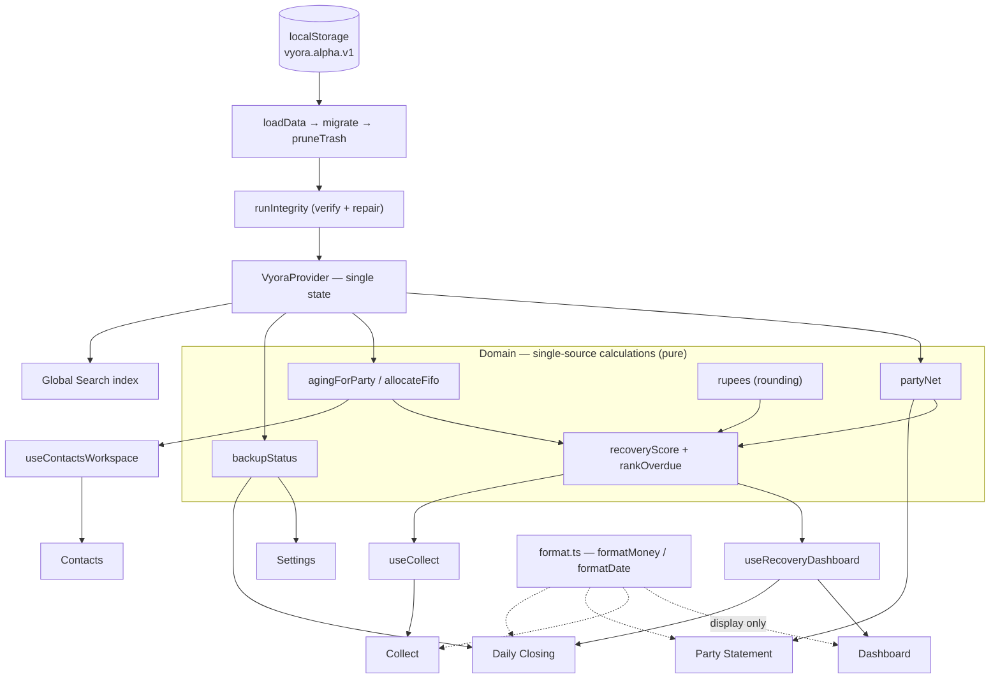

# Vyora — Trust Review (ENG-007)

**Objective:** everything the merchant sees must be explainable — every calculated
value has exactly one source, with no duplicate calculations.

**Scope reviewed:** recovery score · dashboard totals · outstanding · daily closing ·
backup status · search results.

**Method:** traced each merchant-visible value from the screen back to the function
that produces it, then checked whether that value is computed in more than one place
(and whether the copies can diverge).

---

## 1. Findings & fixes

Two values were being calculated in more than one place, and one of them could
actually diverge. Both are now consolidated to a single source (the only code
changes made under this task).

| #   | Value                        | Problem found                                                                                                                                                                                                                                                                                | Fix                                                                                                                                                                       |
| --- | ---------------------------- | -------------------------------------------------------------------------------------------------------------------------------------------------------------------------------------------------------------------------------------------------------------------------------------------- | ------------------------------------------------------------------------------------------------------------------------------------------------------------------------- |
| A   | **Recovery score & ranking** | Assembled independently in `useCollect` **and** `useRecoveryDashboard`, which sorted with **different comparators** (2-level vs 3-level tie-break). Tied overdue contacts could rank differently on the Collect list vs the Dashboard / Daily Closing — the same customer, two "priorities". | Extracted **`rankOverdue(data, overdue)`** in `lib/vyora/aging.ts` — the one scorer + one canonical comparator (score → leverage → most-overdue). Both hooks now call it. |
| B   | **Backup status**            | The "days since backup / is it stale / how long ago" math was duplicated **verbatim** in `Settings` and `DayClosing` (`Math.floor((Date.now() − …) / 86_400_000)`, `stale = age > 7`). Two copies of the same rule.                                                                          | Extracted **`backupStatus(lastBackupAt, now)`** in `lib/vyora/store.ts` (with `BACKUP_STALE_DAYS`). Both screens now read it.                                             |

Everything else reviewed was already single-source (see the map below). Locked in
with tests in `tests/vyora/trust.test.ts`.

---

## 2. Architecture document

Vyora is a **local-first, single-store** app. Data lives in one `localStorage` key
and flows one way: store → domain → hooks → screens. Calculations live in the
**domain layer** (pure functions); screens never re-derive a value, they read it.

```
┌──────────────────────────────────────────────────────────────────┐
│ PERSISTENCE     localStorage "vyora.alpha.v1"  (the only data at rest) │
│                 loadData → migrate → pruneTrash → runIntegrity          │
├──────────────────────────────────────────────────────────────────┤
│ STATE           VyoraProvider — the one React store; every screen      │
│                 reads `data` and calls actions through it              │
├──────────────────────────────────────────────────────────────────┤
│ DOMAIN (pure)   lib/vyora/*                                            │
│   selectors.ts  partyNet · partyStatement · rupees · searchParties     │
│   aging.ts      allocateFifo · agingForParty · recoveryScore ·         │
│                 rankOverdue · daysBetween                              │
│   store.ts      backupStatus · storageSizeBytes · mutations           │
│   integrity.ts  runIntegrity        format.ts  formatMoney/Date        │
├──────────────────────────────────────────────────────────────────┤
│ SELECTOR HOOKS  useRecoveryDashboard · useCollect ·                    │
│ (memoized)      useContactsWorkspace  — one sweep per data change      │
├──────────────────────────────────────────────────────────────────┤
│ SCREENS         Dashboard · Collect · Contacts · Party Statement ·     │
│                 Daily Closing · Settings · Global Search               │
└──────────────────────────────────────────────────────────────────┘
```

**Principles that keep it explainable**

- **Balances are always derived, never stored.** A contact's outstanding is
  `partyNet(data, id)` computed on demand — there is no cached balance to drift.
- **One rounding function.** All money aggregates round through `rupees()`.
- **One ranker, one aging engine.** `agingForParty`/`allocateFifo` is the only FIFO
  implementation; `rankOverdue` is the only recovery ordering.
- **Formatting is display-only.** `formatMoney`/`formatDate` never change a value,
  only how it reads (currency/number/date prefs from `configureFormat`, P3-002).

---

## 3. Calculation map

Every merchant-visible calculated value → its single source → who consumes it.

| Merchant sees                                                               | Single source (function)                                              | File                                     | Consumers                                                                       |
| --------------------------------------------------------------------------- | --------------------------------------------------------------------- | ---------------------------------------- | ------------------------------------------------------------------------------- |
| **Outstanding** (per contact)                                               | `partyNet`                                                            | `lib/vyora/selectors.ts`                 | Party Statement, Contacts, Collect, dashboard hook, Global Search, Party Picker |
| **Receivable aging** (open / overdue / days / buckets)                      | `agingForParty` → `allocateFifo`                                      | `lib/vyora/aging.ts`                     | `collectList`, Party Statement summary, `useContactsWorkspace`                  |
| **Recovery score & priority & order**                                       | `recoveryScore` + **`rankOverdue`**                                   | `lib/vyora/aging.ts`                     | `useCollect`, `useRecoveryDashboard` → Collect, Dashboard, Daily Closing top-5  |
| **Dashboard totals** (outstanding, overdue total, due-today, overdue count) | `useRecoveryDashboard` — one memoized FIFO sweep                      | `features/vyora/useRecoveryDashboard.ts` | Dashboard, Daily Closing                                                        |
| **Daily closing** (today's credit / collection / payment / net cash)        | `DayClosing` `summary` memo (`netCash = collection − payment`)        | `features/vyora/screens/DayClosing.tsx`  | Daily Closing                                                                   |
| **Backup status** (age / stale / "x days ago")                              | **`backupStatus`**                                                    | `lib/vyora/store.ts`                     | Settings, Daily Closing                                                         |
| **Search results**                                                          | Global Search memoized index (over name/phone/reference/notes/amount) | `features/vyora/GlobalSearch.tsx`        | search overlay                                                                  |
| Money rounding                                                              | `rupees`                                                              | `lib/vyora/selectors.ts`                 | every aggregate                                                                 |
| Money / date display                                                        | `formatMoney` / `formatDate` (`configureFormat`)                      | `lib/vyora/format.ts`                    | every screen                                                                    |
| Storage used                                                                | `storageSizeBytes`                                                    | `lib/vyora/store.ts`                     | Settings · Founder                                                              |
| Data integrity                                                              | `runIntegrity`                                                        | `lib/vyora/integrity.ts`                 | provider (startup/import/restore), Founder                                      |

> **Note (transparency):** `overdueList`, `portfolioAging` and `recoverySummary` in
> `aging.ts` are alternate domain aggregates that are **not currently wired to any
> screen** (covered by unit tests only). The live surfaces use the sources above.
> They are left in place for tests and future reuse; they are not a second source
> feeding the UI.

---

## 4. Data flow diagram



---

## 5. Single-source verification

- [x] **Outstanding** — one function (`partyNet`); balances derived, never stored.
- [x] **Recovery score & ranking** — one function (`recoveryScore` + `rankOverdue`); identical order everywhere. _(was duplicated → fixed)_
- [x] **Dashboard totals** — one memoized sweep (`useRecoveryDashboard`).
- [x] **Daily closing** — one memo; `netCash = collection − payment`.
- [x] **Backup status** — one function (`backupStatus`). _(was duplicated → fixed)_
- [x] **Search results** — one memoized index (Global Search).
- [x] Supporting: one rounding (`rupees`), one aging engine (`allocateFifo`), one
      formatter (`format.ts`), one integrity pass (`runIntegrity`).

**Result:** every reviewed value is now traceable to exactly one source. Verified by
`npm run validate` (type-check + lint + 2025 tests + build).
